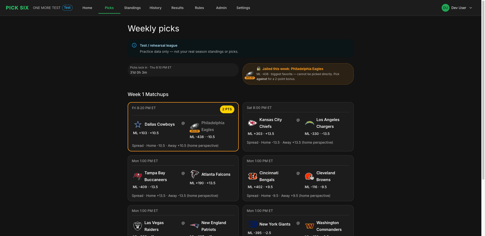
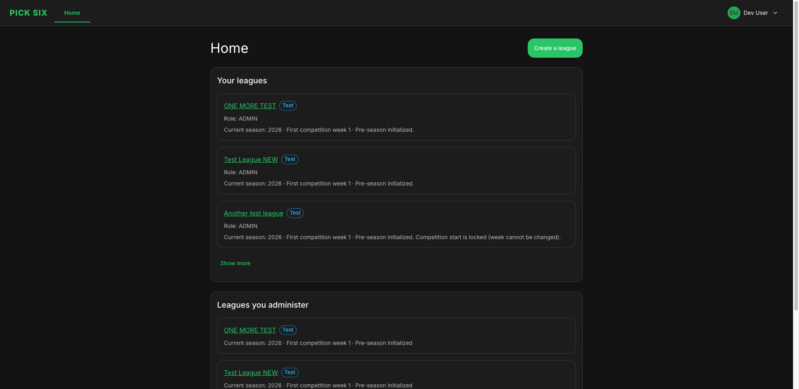

# Pick Six

**Pick Six** is a web app for running custom NFL pick’em leagues — automated weekly ops (reminders, jailed team, deadlines, scoring), live odds for picks, and a rule engine for mechanics generic fantasy sites do not support.

Built with **Next.js**, **MUI**, and **Prisma** / PostgreSQL. This is also a personal project for experimenting with [BMAD Method](https://github.com/bmad-code-org/BMAD-METHOD) ([docs](https://docs.bmad-method.org/)).

<p align="center">
  
</p>

<p align="center">
  
</p>

## Features

- League admin setup: create leagues/seasons, email invites, settings, and participant home
- Weekly picks with live odds, spreads, weather, and deadline enforcement
- Jailed-team mechanics and season-long no-duplicate team rules
- Admin tools: submission status, pick overrides, audit trail
- Automated scoring, standings, and Tuesday reveal
- Transactional email (digests, reminders) and cron-driven ops

## Getting started

1. **Install dependencies**

   ```bash
   npm install
   ```

   After install, `postinstall` runs `prisma generate` (with the same `.env` / `.env.local` loading as the `db:*` scripts).

2. **Database (PostgreSQL + Prisma)**

   Copy `.env.example` to `.env.local` and set **`DATABASE_URL`** and **`DIRECT_URL`**.

   - **Neon:** Use the **pooled** connection string (host contains `-pooler`) for `DATABASE_URL`, and the **direct** string for `DIRECT_URL`. See [Neon — Connect from Prisma](https://neon.tech/docs/guides/prisma).
   - **Local Postgres:** You can set both variables to the same URL.

   Apply migrations (npm scripts load `.env.local`; plain `npx prisma` only loads `.env`):

   ```bash
   npm run db:migrate
   ```

   For production / CI against an existing migration history:

   ```bash
   npm run db:migrate:deploy
   ```

   Optional: `npm run db:studio` opens Prisma Studio. `npm run db:seed` seeds data and prints a signup URL for a seeded invite.

3. **Run locally**

   ```bash
   npm run dev
   ```

   Open [http://localhost:3000](http://localhost:3000).

**Other scripts:** `npm run build` / `npm run start`, `npm run lint`, `npm test` (watch: `npm run test:watch`).

## Planning & BMAD

Planning outputs live under [`_bmad-output/planning-artifacts/`](_bmad-output/planning-artifacts/) — start with [`prd.md`](_bmad-output/planning-artifacts/prd.md) for scope and requirements.

Sprint and story status: [`_bmad-output/implementation-artifacts/sprint-status.yaml`](_bmad-output/implementation-artifacts/sprint-status.yaml) (per-story notes in the same folder).

**BMAD in this repo (v6):** Install and config live under [`_bmad/`](_bmad/) (manifest, `core` / `bmm` module settings, skill index).

Install or upgrade with `npx bmad-method install` (Node 20+). Docs: [How to install BMAD](https://docs.bmad-method.org/how-to/install-bmad/), [Upgrade to v6](https://docs.bmad-method.org/how-to/upgrade-to-v6/).
